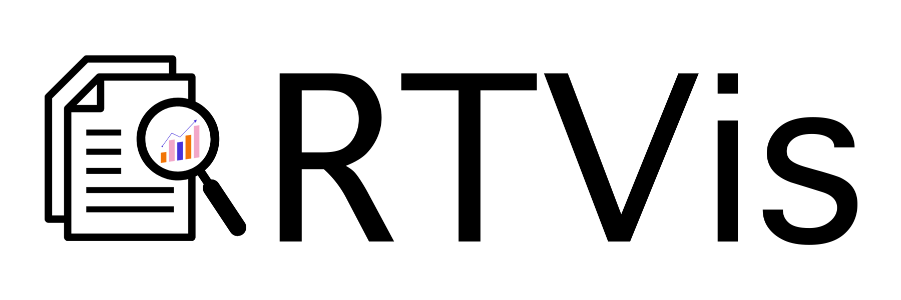

# RTVis: Research Trend Visualization Toolkit


<p align="center">
<a href="https://docs.rtvis.design"></a>
</p>


<!-- centering -->
<p align="center">


</p>

## Introduction

When researchers and practitioners are about to start a new project or have just entered a new research field, choosing a proper research topic is always challenging. To help them have an overall understand- ing of the research trend in real-time and find out the research topic they are interested in, we develop the Research Trend Visualization toolkit (RTVis) to analyze and visualize the research paper infor- mation. RTVis consists of a co-occurrence network, a specialized citation bar chart, a word frequency race diagram, and a field theme river, showing the cooperating relationship among authors, paper citation numbers in different venues, the most common words in the abstract part, and field change through time respectively. Moreover, RTVis is open source and easy to deploy. The demo of our toolkit and code with detailed documentation are both available online.

## Installation

### Method 1: Directly run the program (Support Windows, Linux, Mac OS)

1.  Download the latest release by
```bash
git clone https://github.com/RTVis/RTVis.git
cd RTVis
```
2.  Install the dependencies
```bash
pip install -r requirements.txt
```
3.  Preprocess the data
```bash
python dataprocessing.py
```
4.  Run the program
```bash
python app.py
```
5.  Open the browser and visit the website
```
http://localhost:8050/
```
### Method 2: Run the program in Docker (Support Windows, Linux, Mac OS)

1. Download the latest release by
```bash
git clone https://github.com/RTVis/RTVis.git
cd RTVis
```
2. Build the docker image
```bash
docker build -t rtvis .
```
3. Run the docker image
```bash
docker run -p 8050:8050 rtvis
```
4. Open the browser and visit the website
```
http://localhost:8050/
```

(Optional) 5. If you want to run the program in the background, you can use the following command

```bash
docker run -d -p 8050:8050 rtvis
```

Or you can use the `docker-compose.yml` file to run the program in the background
```bash
docker-compose up -d
```
